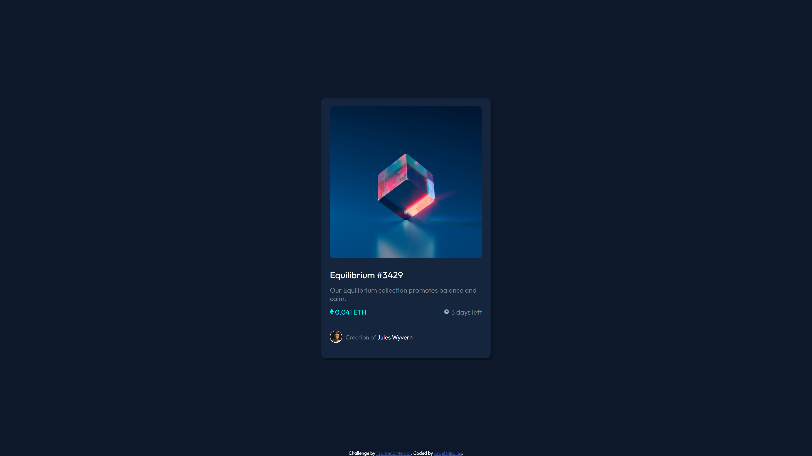
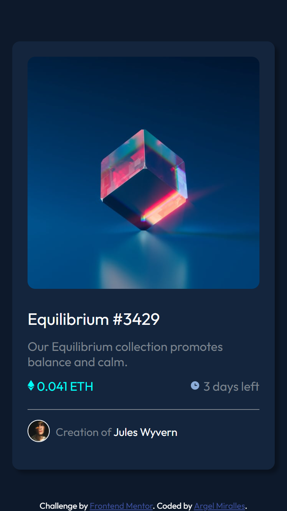

# Frontend Mentor - NFT preview card component

Note: The photo above is the design preview for the challenge. The actual preview of my project can be seen below.

## Welcome! 👋

Thanks for checking out this front-end coding challenge.

This is a simple web application showcasing my command of HTML and CSS.

## The challenge

The card itself is prettystraightforward to code. The trickiest part of this challenge is the card's active state which shows a colored overlay with an icon in the center over the card's main image.

## My solution

To implement the tricky overlay effect, I used the pseudo element "::after" to create a hidden child element of the card image container and make it the same height and width with its
parent container, have the color different and icon as a background centered, and "hide" it by using opacity. Then, I used the ":hover" pseudo class to turn the said child container's
opacity to 1, creating the overlay effect over the card image on hover.

## Technologies used

- HTML - Used to create the index.html file
- CSS - Used to design the webpage
- VSCode - IDE I used to create the web app
- Git - For version control
- Netflify - Used to host this web app

## Preview

## Deployment

You may visit the deployed web app through the link below.

- [https://amiralles-nftcardchallenge.netlify.app/](https://amiralles-nftcardchallenge.netlify.app/)

## Footer

Thank you for taking the time in checking out this repository.

**Argel Miralles | Full Stack Web Developer** 
**SIC PARVIS MAGNA**☝
